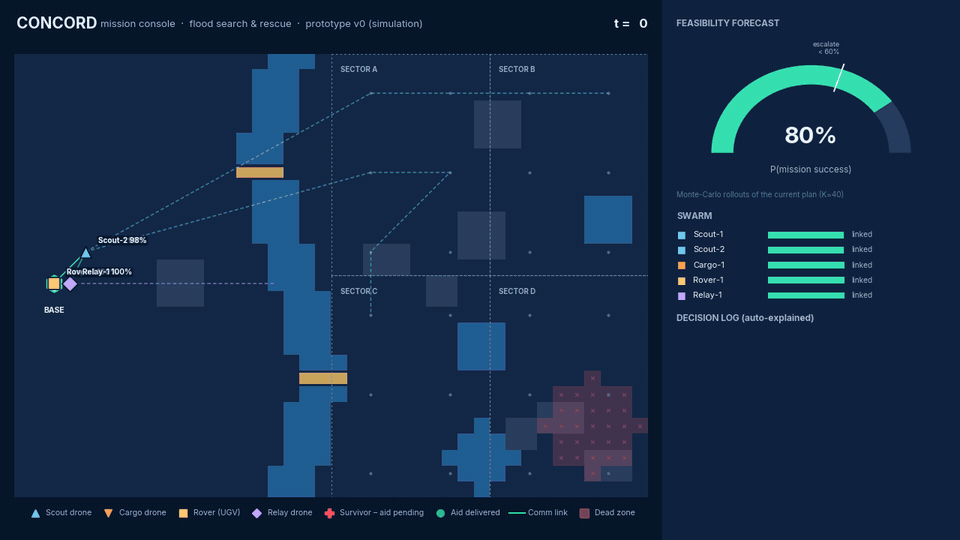

# CONCORD

**Mission orchestration for heterogeneous robot and drone swarms** · ELEVATE 1.0 · EL-05

> Tell the swarm what you want done. CONCORD decides who does what, re-plans the moment the world changes, and asks a human only when it genuinely should.

*LLMs understand intent. Algorithms make decisions. Humans own the hard calls.*



## What it does

A flood search-and-rescue team of five agents — two scout drones, a cargo drone, a ground rover and a relay drone — has to survey four sectors, find survivors and get a med-kit to each one while bridges collapse, storms form, radios black out and hardware fails. CONCORD is the mission layer above the robots:

- **Allocate** — a CBBA-style auction with time-discounted bids, energy and storm-risk penalties and a battery-reserve invariant.
- **Re-plan** — local repair auctions on every event; global re-plans on storms, bridge loss and every 30 ticks, with hysteresis against churn.
- **Stay connected** — relay repositioning, value-of-information messaging, and report-seeking detours out of dead zones.
- **Forecast** — 40 Monte-Carlo rollouts of the live plan give P(mission success) after every disruption.
- **Escalate** — below 60% the operator gets a decision card with the odds of each option and a safe default on timeout.
- **Explain** — every autonomous decision is logged as a one-line reason, with the full auction behind it.

## Results (v0, simulation)

300 seeded scenarios, 1,676 survivors, identical random draws for every policy, 95% bootstrap CIs:

| | CONCORD | Greedy dispatch | Static plan |
|---|---|---|---|
| Mission success | **99.0%** | 96.3% | 20.0% |
| Mean time-to-aid (ticks) | **62.4** | 71.1 | 174.2 |
| Critical-report latency (ticks) | **0.84** | 8.71 | 8.09 |
| Avoidable asset losses / mission | **0.107** | 0.197 | 0.223 |

Under six simultaneous disruption types: **96%** success vs 88% (greedy) and 16% (static). Repair re-plans stay under 10 ms at 200 agents.

## Run the console

Requires Python 3.10+ and Node 18+.

```bash
cd prototype
pip install numpy fastapi uvicorn
cd console && npm install && npm run build && cd ..
python -m server
```

Open <http://127.0.0.1:8000>, compile the default objective, and deploy the **Storyboard** scenario. Use **Break the plan** to inject disruptions live.

Or with Docker:

```bash
docker build -t concord prototype
docker run -p 8080:8080 concord      # → http://127.0.0.1:8080
```

### Hosted demo (Vercel, frontend only)

The console also builds as a static site that needs no engine: each mission is a stream recorded from the real engine and replayed in the browser, and at the operator escalation every option replays its own recorded outcome. Four missions are included — the storyboard (with the escalation), two random benchmark scenarios, and an "operator chaos" run with five injected disruptions. Pause, step, speed, the map, the decision log, the forecast and the Evidence and Method pages all work; injecting new disruptions needs the live engine.

```bash
cd prototype/console && npm run build:demo   # → dist/, servable by any static host
```

`vercel.json` at the repo root builds this for Vercel: import the repository at <https://vercel.com/new>, keep the defaults, and deploy. To re-record the missions after changing the engine, run `python record_demo.py` in `prototype/` (writes `console/public/demo/`).

## Repository

| Path | Contents |
|---|---|
| [`prototype/`](prototype/) | Simulator, CONCORD policy, baselines, benchmark, live console — see its [README](prototype/README.md) for reproduction steps |
| [`prototype/server/`](prototype/server/) | FastAPI + WebSocket server around the engine |
| [`prototype/console/`](prototype/console/) | React + TypeScript mission console (`public/demo/` holds the recorded demo missions) |
| [`prototype/results/`](prototype/results/) | Benchmark, stress-sweep, ablation and scaling results |
